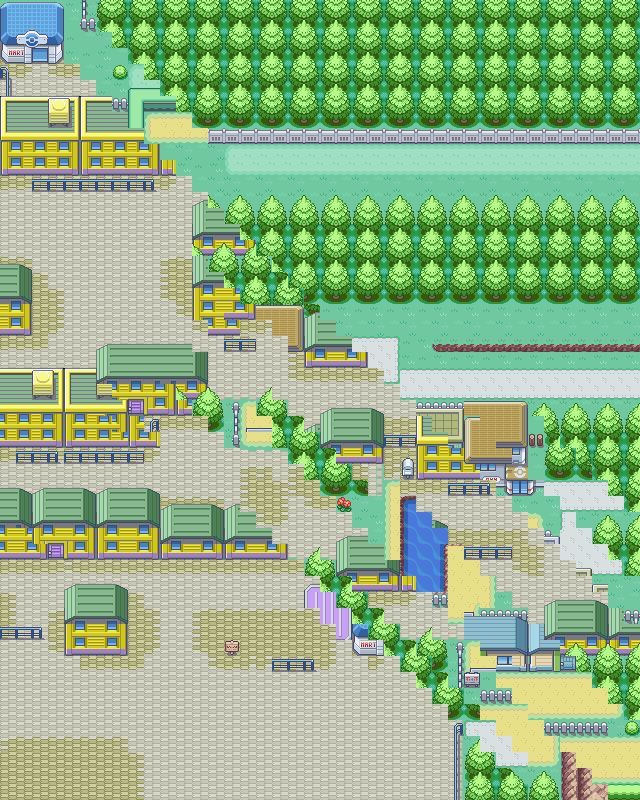
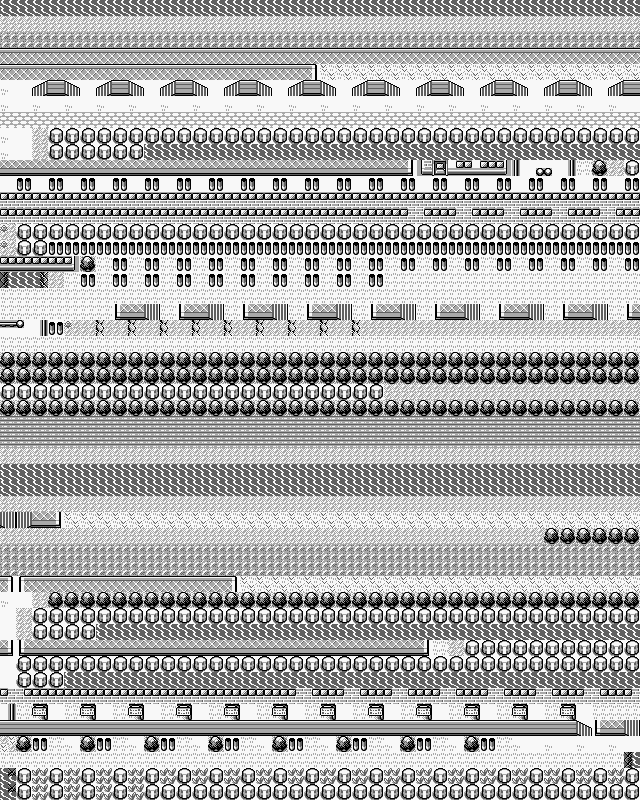
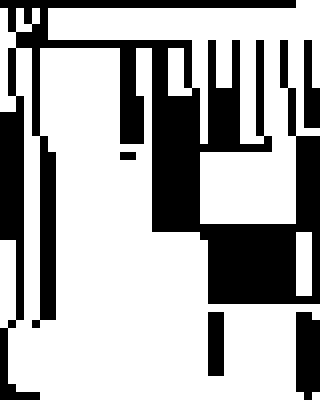

# Introduction
The development of a video game requires a great variety of assets. A typical
game combines music, art and code to form a coherent whole.

This need for resources is one of the reasons why games are so costly to
develop. Procedural content generation---the automatic creation of content---has
emerged as an answer to this problem and is currently widely used, particularly
in studios with few resources. For example, *No Man's Sky (2016)* is
a space exploration game that uses procedural generation to generate a whole
universe of over 18 quintillion planets $1.8 \cdot 10^{19}$, suffice to say that
you would need many lifetimes to explore them all.

Most approaches to procedural generation are rule based, meaning that they rely
on the definition of explicit rules. L-systems [@Lindenmayer1968] are an example
of such a rule based system, which allows the creation of tree-like structures.
The limitations of rule based systems lies in the fact that they cannot learn
from already existing examples and reproduce them. We would not be able to show
an L-system images of oaks for example and expect it to reproduce trees in the
same style. We would need to define exactly the rules that represent "oakness",
the attributes give rise to the distinct features of the oak.

Data-driven techniques for procedural generation are still relatively rare; in
this paper we try to see whether it is possible to reproduce the spatial style
of a given game using data-driven techniques.

- We show how 2d Markov chains can be applied to the generation of 2d tile-maps
  that are non-linear in nature. As opposed to past litterature [@Snodgrass2013]
  we use maps with a larger number of tile types. [Section @sec:background]
  provides a few background information on what tile-maps are and their current
  uses while [Section @sec:markov-chains] describes the technical side of 2d
  Markov chains.
  
- We argue that the generated maps keep the spatial style of the originals by
  comparing how different input maps influence the generated maps in
  [Section @sec:spatial-style].

- We come up with a backoff smoothing method appropriate for 2d chains. First we
  explain why it can be useful in [Section @sec:idea] and then we give the
  technical details of its implementation in [Section @sec:backoff].

- We provide a C# implementation of a text based 2d Markov chain which is
  accessible at the following link^[https://github.com/stonecauldron/markov2d].

# Background {#sec:background}
First of all let us define more precisely what a tile-map is. Tile-maps are a
staple of many genres of games, they are formed by individual tiles of
predefined size and assembled into a grid.

{ width=75% }

Game developers make use of tile-maps for various reasons:

- They reduce the number of art assets that need to be created for the game
  since the same tile can be reused in multiple places.
- Levels created with tile-maps can be easily represented in a digital format;
  we can represent them as a matrix where each entry contains a tile identifier.
- They allow the level designer to create new levels without having to worry
  about creating new art assets. In some cases this can be extended into
  fully-fledged level editors where the players themselves can create new
  levels^[A striking example is the game *Super Mario Maker* which is built
  entirely around the concept of players creating *Mario Bros.* levels.].
- They permit the separation of gameplay and visual appearance. Tiles can for
  example represent non-traversable and empty space independently from their
  look in-game.

Traditionally tile-maps are built manually: the level designer chooses one tile
for each cell of the grid. Given that the grids can be very large, we can easily
imagine that this is a time-consuming process. It puts a human limit into the
size of the maps that can be used in a game. Being able to generate these maps
procedurally would lift a burden off the shoulders of the level designers and
allow the generation of much larger worlds.

The use of tile-maps might seem like an outdated method but they are still used
in many independent games, some of which have been quite successful^[*Stardew
Valley (2016)* or *Undertale (2015)* are both million seller games that make use
of tile-maps.].

# The idea {#sec:idea}
Let us remind you of our objective; we want to be able to generate tile-maps
from a set of representative examples. Our process has the following steps:

1. We choose the set of maps whose spatial style we want to reproduce.
2. We represent the maps as matrices where each entry contains a tile type
   identifier. This will be our input dataset.
3. We generate a Markov chain whose probability distributions reflect those of
   the original dataset. This is the learning phase of the model.
4. We then sample this Markov chain to generate a map of any given dimension.

This is comparable to the case where Markov chains are used for automatic essay
writing [@Murphy2012]. These automatically written essays use
similar idioms and vocabulary to the ones present in the learning dataset; in a
certain sense they emulate the style of a given text. For the same reasons we
expect our Markov chains to reproduce the spatial style of its learning
examples.

One of the problems that appears when sampling Markov chains is that is likely
for a chain to generate a sequence of elements that do not exist in the training
dataset. As an example take the word predictors that are present in most mobile
phones today; Imagine you have just typed the words "Colorless green ideas
sleep"^[This sentence is an example of a grammatically correct sentence with no
meaning which we can assume does not occur in a standard English text. Taken
from Chomsky 1956], since this sentence is not present in the training corpus,
the Markov chain will not be able to infer what the next most probable word is
and will have to stop generating text.

A way of solving this problem is to use what is called backoff smoothing
[@Murphy2012] in which we consider less elements of the chain when faced with
unknown data. To take our above example again, instead of considering the whole
chain to infer the next most likely word we can restrict ourselves to the
previous word only, which in this case is "sleep". By reducing the number of
elements we consider in the chain, we increase the chances of finding equivalent
sequences in the training data, thus improving the robustness of the model.

While the definition of backoff smoothing is simple with linear chains, it
becomes more complicated in the case of 2d chains. Our approach is detailed in
[Section @sec:backoff].

# Results
In this section we will try to evaluate qualitatively a set of maps generated
with our method. To this end we will use data from the game *Pokemon Red (1996)*
and *Pokemon FireRed (2004)*. The *FireRed* version is a remake of the *Red*
version meaning that is mainly a visual upgrade of the first game; the locations
and the spatial distribution of both games are very similar. This allows us to
see first hand the effects of an increase in the number of unique tiles:
*Pokemon Red* has 125 unique tiles while *Pokemon FireRed* has 1207 different
tiles.

{ width=50% #fig:red-result }

{ width=50% #fig:firered-result }

In the *Red* version (@fig:red-result) the overall results looks quite
promising:

- Except a patch of grass in the center, almost all the navigable space in the
  map is reachable.
- Aesthetically the map is plausible; it is comparable to what we can find in
  the original *Pokemon Red* game with a similar distribution of tiles.
- There are few incomplete structures in the map, mainly the buildings. This is
  due to the fact that they are the structures with the largest number of
  dependencies in the tiles that compose them.

In *FireRed* (@fig:firered-result) the result is much worse though, there is a much larger
number of incomplete structures and while the map looks believable locally, the
transition between a forest environment and a city environment in the diagonal
is problematic.

This is due to the following facts:

- The *FireRed* version has a higher number of tiles that do not make sense when
  they are taken individually. The trees in *FireRed* for example are composed
  of multiple tiles while in *Red* they take up only one tile.
- *FireRed* uses many tiles that have similar meaning but different appearances.
  The visual look of houses in *FireRed* are very varied while in *Red* they are
  much more homogeneous.
- The problem on the diagonal suggests that there is not enough data for
  transitions between different environments. The diagonal shape is due to the
  ways the backoff smoothing works: in this case it has not enough data to
  generate the tiles and must rely only on the diagonal predecessors to generate
  the next tile.

These problems come from the fact that the dependencies between the map elements
have a farther reach than what can appropriately be captured by the method. This
lead us to believe that to work on games with large tilesets we would need a
higher amount of data. Alternatively a few possible improvements to the method
are discussed in [Section @sec:conclusion].

The computational complexity of our method is linear in relation to the map size
for both training and generation ^[This remains true as long as we assume to
take a relatively small number of predecessors into account. See [Section
@sec:backoff] for more details.]. This implies we can imagine using the method
to generate maps dynamically providing players with new levels at each
playthrough.
  
# Technical details

## 2d Markov chains {#sec:markov-chains}
Markov chains are a mathematical formalism that allows us to model state
transitions of a stochastic process. The particularity of Markov chains is that
they only take the current state of the system into account to compute the next
state. We can for example model the weather by two states: *sunny* and *rainy*
and define that the probabilities of the weather being either sunny or rainy the
next day only depend on the current weather.

In our use case we represent a tile-map as a matrix where each entry corresponds
to a specific tile. The Markov chain generating the map will have one state per
tile type and will fill the matrix of the tile-map sequentially by sampling the
next state at each entry.

The chains are trained on the example data with a frequency computation.
We used the approach that is detailed in @Snodgrass2013.

This assumption that the next state only depends on the current state is called
the *Markov property*. This property can be extended to hold on any number of
previous states of the system, in which case we talk about higher order Markov
chains. We can even assume that the predecessors are not only linear but that
they are taken in multiple dimensions.

\begin{figure}[h]
\centering
\begin{tikzpicture}[scale=0.2]
\tikzstyle{every node}+=[inner sep=0pt]
\draw [black] (7.7,-6.6) circle (3);
\draw (7.7,-6.6) node {$S_{1,1}$};
\draw [black] (18.3,-6.6) circle (3);
\draw (18.3,-6.6) node {$S_{1,2}$};
\draw [black] (28.8,-6.6) circle (3);
\draw (28.8,-6.6) node {$S_{1,3}$};
\draw [black] (7.7,-15.8) circle (3);
\draw (7.7,-15.8) node {$S_{2,1}$};
\draw [black] (18.3,-15.8) circle (3);
\draw (18.3,-15.8) node {$S_{2,2}$};
\draw [black] (28.8,-15.8) circle (3);
\draw (28.8,-15.8) node {$S_{2,3}$};
\draw [black] (39,-6.6) circle (3);
\draw (39,-6.6) node {$...$};
\draw [black] (39,-15.8) circle (3);
\draw (39,-15.8) node {$...$};
\draw [black] (7.7,-24.8) circle (3);
\draw (7.7,-24.8) node {$...$};
\draw [black] (18.3,-24.8) circle (3);
\draw (18.3,-24.8) node {$...$};
\draw [black] (28.8,-24.8) circle (3);
\draw (28.8,-24.8) node {$...$};
\draw [black] (7.7,-9.6) -- (7.7,-12.8);
\fill [black] (7.7,-12.8) -- (8.2,-12) -- (7.2,-12);
\draw [black] (10.7,-6.6) -- (15.3,-6.6);
\fill [black] (15.3,-6.6) -- (14.5,-6.1) -- (14.5,-7.1);
\draw [black] (21.3,-6.6) -- (25.8,-6.6);
\fill [black] (25.8,-6.6) -- (25,-6.1) -- (25,-7.1);
\draw [black] (10.7,-15.8) -- (15.3,-15.8);
\fill [black] (15.3,-15.8) -- (14.5,-15.3) -- (14.5,-16.3);
\draw [black] (21.3,-15.8) -- (25.8,-15.8);
\fill [black] (25.8,-15.8) -- (25,-15.3) -- (25,-16.3);
\draw [black] (18.3,-9.6) -- (18.3,-12.8);
\fill [black] (18.3,-12.8) -- (18.8,-12) -- (17.8,-12);
\draw [black] (28.8,-9.6) -- (28.8,-12.8);
\fill [black] (28.8,-12.8) -- (29.3,-12) -- (28.3,-12);
\draw [black] (7.7,-18.8) -- (7.7,-21.8);
\fill [black] (7.7,-21.8) -- (8.2,-21) -- (7.2,-21);
\draw [black] (18.3,-18.8) -- (18.3,-21.8);
\fill [black] (18.3,-21.8) -- (18.8,-21) -- (17.8,-21);
\draw [black] (28.8,-18.8) -- (28.8,-21.8);
\fill [black] (28.8,-21.8) -- (29.3,-21) -- (28.3,-21);
\draw [black] (10.7,-24.8) -- (15.3,-24.8);
\fill [black] (15.3,-24.8) -- (14.5,-24.3) -- (14.5,-25.3);
\draw [black] (21.3,-24.8) -- (25.8,-24.8);
\fill [black] (25.8,-24.8) -- (25,-24.3) -- (25,-25.3);
\draw [black] (31.8,-6.6) -- (36,-6.6);
\fill [black] (36,-6.6) -- (35.2,-6.1) -- (35.2,-7.1);
\draw [black] (31.8,-15.8) -- (36,-15.8);
\fill [black] (36,-15.8) -- (35.2,-15.3) -- (35.2,-16.3);
\draw [black] (39,-9.6) -- (39,-12.8);
\fill [black] (39,-12.8) -- (39.5,-12) -- (38.5,-12);
\end{tikzpicture}
\caption{A figure showing the dependencies in a 2d Markov chain}
\end{figure}

The number and position of previous tiles that are taken into account are
explicitly defined by the predecessors matrix.

\begin{figure}[h]
\centering
$
P_1=
\begin{pmatrix}
 0& 1& 0\\ 
 0& 0& 0\\ 
 0& 0& 0 
\end{pmatrix}
$
$
P_2= 
\begin{pmatrix}
 0& 0& 0\\ 
 1& 0& 0\\ 
 0& 0& 0 
\end{pmatrix}
$
$
P_3=
\begin{pmatrix}
 0& 1& 1\\ 
 1& 1& 1\\ 
 1& 1& 1 
\end{pmatrix}
$
\caption{Various predecessors matrices: $P_1$ only takes into account the
nearest left neighbour, $P_2$ only the nearest upper neighbour and $P_3$ takes
all neighbours that are at a distance of 3 or less of the current tile.}
\end{figure}

{ width=55% #fig:3k-map }

{ width=55% #fig:1k-map }

As we can see in @fig:3k-map and @fig:1k-map the choice of the predecessor has a
big influence on the outcome of the generation. In @fig:1k-map each tile takes
only its immediate left neighbour into account, the chain is linear and we can
easily see that there are no relations between each rows. In @fig:3k-map we use
a predecessors matrix that is two-dimensional and we can immediately see that
the generated map produced much more complex spatial structures as evidenced by
the presence of elements composed by a combination of tiles such as houses and
buildings.

In general, larger predecessor matrices allow the expression of more complex
structures, their use however is limited by the fact that they require more data
to train. Imagine we take a predecessor matrix of the size of the training maps,
then the trained Markov chain would only be able to generate copies of its
training data since it has not learned anything else. We thus lose the potential
for variability in the maps generated with larger predecessor matrices.

## Spatial style conservation {#sec:spatial-style}
For our approach to be valid, the generated maps must reproduce the spatial
style that is present in the training data-set. If this assumption is true then
we expect that if we take two different games as training data that the
generated maps will be different not only in the aesthetic sense but also in the
spatial sense. As we said in [Section @sec:background] we can associate each
tile with spatial meaning by defining if it is traversable by the player or not.
We can then represent the tile-maps with only two tile types:

- A tile representing empty space depicted as a black tile.
- A tile representing an obstacle depicted as a white tile.

To this end we generate two tile-maps with different games as training data; in
@fig:mario-binary we use levels from *Mario* as training data and in
@fig:red-binary we use use training data from *Pokemon*. We can immediately
notice differences in the structure of the maps:

- The empty space in the *Mario* map is almost all concentrated in the upper
  part of the level. This is to give the player room to jump and traverse the
  obstacles of the level. In the *Pokemon* map however the empty space is much
  more dispersed; this can be explained by the fact that the player can
  navigate in two-dimensions.
- We can clearly see a ground-like structure in the bottom of the *Mario* level
  and a few airborne platforms while the distribution of the obstacles in the
  *Pokemon* map is much more varied.
  
The differences in these binary maps can be attributed to the way the players
navigate space in their respective games. In *Mario* the player moves through
the levels in a left to right direction avoiding enemies and obstacles by
jumping; the levels have only one direction of progression. In contrast to the
*Mario* games, in *Pokemon* the players can freely move with two degrees of
freedom, the progression is non-linear and much less constrained. Given these
differences in the generated maps we can assume the Markov chains do succeed in
reproducing the spatial style of their training data.

{ width=50% #fig:mario-binary }

{ width=50% #fig:red-binary }

## Backoff smoothing in 2d {#sec:backoff}
As explained before, backoff smoothing is useful when the Markov chain
encounters unknown states in the generated data; it allows us take less
predecessors into account when needed.

With linear Markov chains the backoff smoothing is easy to define: for example,
if we take three previous states into account usually, we can take two instead.
For 2d chains the problem is not so trivial since it is not clear which elements
we have to take and how many of them.

To facilitate our discussion we say that a predecessors matrix $S$ is a
sub-matrix of predecessors matrix $P$ if it satisfies the following
requirements:

- $S$ must take less elements into account than $P$
- $S$ must not take into account elements that are at a larger distance than $P$

We can then simply implement backoff smoothing by taking a sub-matrix of our
current predecessors matrix. This is done in a recursive manner by removing one
element at the largest distance at a time. More formally, the list of
sub-matrices of a predecessor matrix $P$ is given by:

\begin{equation}
subMatrices(P) \coloneqq\begin{cases}
\bigcup_{k \in K} subMatrices(k), & \text{if $k \neq 0$}.\\
0, & \text{otherwise}.
\end{cases}
\end{equation}

where $K$ is the set of all matrices that are equal to $P$ minus one of the
elements at the largest distance.

\begin{figure}[h]
\centering
$
\begin{pmatrix}
 0& 1& 2\\ 
 1& 1& 2\\ 
 2& 2& 2 
\end{pmatrix}
$
\caption{A matrix showing the notions of distance, each number gives the distance of the corresponding cell}
\end{figure}

{ width=50% #fig:backoff }

In @fig:backoff we can see the results of a map generated without backoff
smoothing. The map starts off well with the house on the upper left but then
quickly degrades as soon it encounters a combination of tiles that are not
present in the training data. By mitigating this effect backoff smoothing
significantly improves the overall quality of the generated maps. A drawback of
the backoff smoothing method is that it increases the computational time of both
generation and training exponentially with the size of the predecessors matrix.
This implies that in practice we cannot use very large predecessors matrices.

# Related work
Game companies generally do not publish their procedural content generation
methods so it is hard to evaluate what is common in the industry. In academia,
researchers have looked into various approaches for automatic level generation.
The game *Super Mario Bros.* in particular has received much attention.

@Shaker2012 uses generative grammars combined with an evolutionary algorithm to
create *Mario* levels that adapt themselves to the player's experience. In
another paper, @Sorenson2010 also use an evolutionary algorithm to
create a generic framework for level creation. Their approach allows the level
designer to enforce multiple constraints on the generated levels making it
adaptable to multiple genres of games.

Rather than being evolutionary, our method draws from machine learning
techniques. The designers do not have to explicitly articulate rules about their
designs but simply need to provide the system with examples of what they want to
create.

Papers using machine learning methods to generate content are still a minority,
but the trend seems to be on the rise. Our use of Markov chains is directly
inspired by the work of @Snodgrass2013 and @Dahlskog2014. They both use Markov
chains to create *Mario* levels with very convincing results. The difference
with our approach lies in the fact that *Mario* levels have a linear nature. The
maps we focus on are non-linear; the player can move through both dimensions.
Additionally we use maps with a much higher number of tiles: *Pokemon red* has a
total number of 125 unique tiles, *Pokemon FireRed* has 1207 unique tiles, in
contrast the maps used by @Snodgrass2013 have only 11 unique tiles. Our sample
is more representative of modern games in which the technological constraints
limiting the number of unique tiles have almost disappeared.

@Summerville2015 explore non-linear level generation in the context of dungeons
for the game *The Legend of Zelda*. Their use of a graph to represent the game
space comes from @Dormans2010. Our focus is more on world maps rather than
dungeons. Dungeons have a clear compartmentalization of individual rooms while
world maps have a more organic unfolding of space. Furthermore, dungeons have
elements such as locked doors that restrict the order in which the player can
traverse the rooms. World maps typically do not have these types of constraints.

Finally, the video game level corpus provided by @Summerville2016 supplied us
with the necessary data to generate *Super Mario Bros* maps.

# Conclusion and further research {#sec:conclusion}
While not perfect, our method shows that Markov chains have potential for the
generation of non-linear maps particularly when the number of unique tiles is
relatively small.

There are many ways our method could improved:

- We could create quantitative measures of map quality, generate a large number
  of them and then select only the best. Since maps can be created relatively
  fast this should be feasible, the only drawback being that it is hard to
  define measures of map quality that are independent of the game being used.
- We could find ways of grouping semantically similar tiles into the same
  high-level concepts and thus reduce the total number of unique tiles in the
  tile-maps.
- Instead of using 2d Markov chains, we could use Markov random fields
  [@Murphy2012]. Their main difference with Markov chains lies in the fact that
  they encode dependencies between their elements in a non-sequential way. Since
  we want to create non-linear maps they might be better suited for the task.
  The disadvantage of using Markov random fields comes from the fact that they
  are harder to implement and they both require more time to train and to sample
  appropriately.

Our approach is not restricted to games and we can easily imagine using this
method with 3D models composed of voxels. Tiles would be replaced by voxels and
the Markov chains would be extended to work in 3d.

In the end though, machine learning techniques for content generation have
inherent limits that make the removal of human intervention not conceivable
at the moment:

- All the data used for training is created by humans, we cannot expect to use
  these methods in areas where data is scarce or non-existent.
- Machine learning techniques have a hard time capturing high-level themes,
  their creations make sense at a local scale but fail to reproduce the holistic
  feel of the training data. In the case of a game, levels are often organized
  with the intention of teaching a player a new gameplay mechanic. For example,
  the underlying theme of a *Mario* level could be showing the player how to
  handle flying enemies, all the level would be built around this motif. A
  data-driven algorithm trained on all the available levels in *Mario* would mix
  data from thematically different levels and thus fail to accurately portray
  the intention of the designers. In theory this problem could be solved by
  having a separate dataset for each possible theme in a game, in practice
  though, designers only create one example for each theme which is clearly not
  sufficient.
  
In conclusion, we do not see these methods as a replacement for the designer but
rather as a tool, taking over in the most repetitive parts of the work. The
designer is then free to focus on what really matters: transmitting his creative
vision.

# References

---
references:
- id: Chomsky1956
  type: article-journal
  author:
  - family: Chomsky
    given: Noam
  issued:
  - year: '1956'
  title: '[Three models for the description of language]{.nocase}'
  container-title: IRE Transactions on Information Theory
  page: '113-124'
  volume: '2'
  issue: '3'
  abstract: We investigate several conceptions of linguistic structure to determine
    whether or not they can provide simple and “revealing” grammars that generate
    all of the sentences of English and only these. We find that no finite-state Markov
    process that produces symbols with transition from state to state can serve as
    an English grammar. Furthermore, the particular subclass of such processes that
    produce&lt;tex&gt;n&lt;/tex&gt;-order statistical approximations to English do
    not come closer, with increasing&lt;tex&gt;n&lt;/tex&gt;, to matching the output
    of an English grammar. We formalize-the notions of “phrase structure” and show
    that this gives us a method for describing language which is essentially more
    powerful, though still representable as a rather elementary type of finite-state
    process. Nevertheless, it is successful only when limited to a small subset of
    simple sentences. We study the formal properties of a set of grammatical transformations
    that carry sentences with phrase structure into new sentences with derived phrase
    structure, showing that transformational grammars are processes of the same elementary
    type as phrase-structure grammars; that the grammar of English is materially simplified
    if phrase structure description is limited to a kernel of simple sentences from
    which all other sentences are constructed by repeated transformations; and that
    this view of linguistic structure gives a certain insight into the use and understanding
    of language.
  DOI: 10.1109/TIT.1956.1056813
  ISBN: '0096-1000'
  ISSN: '0096-1000'

- id: Cross1983
  type: article-journal
  author:
  - family: Cross
    given: George R.
  - family: Jain
    given: Anil K.
  issued:
  - year: '1983'
  title: Markov Random Field Texture Models
  container-title: IEEE Transactions on Pattern Analysis and Machine Intelligence
  page: '25-39'
  volume: PAMI-5
  issue: '1'
  abstract: We consider a texture to be a stochastic, possibly periodic, two-dimensional
    image field. A texture model is a mathematical procedure capable of producing
    and describing a textured image. We explore the use of Markov random fields as
    texture models. The binomial model, where each point in the texture has a binomial
    distribution with parameter controlled by its neighbors and “number of tries”
    equal to the number of gray levels, was taken to be the basic model for the analysis.
    A method of generating samples from the binomial model is given, followed by a
    theoretical and practical analysis of the method’s convergence. Examples show
    how the parameters of the Markov random field control the strength and direction
    of the clustering in the image. The power of the binomial model to produce blurry,
    sharp, line-like, and blob-like textures is demonstrated. Natural texture samples
    were digitized and their parameters were estimated under the Markov random field
    model. A hypothesis test was used for an objective assessment of goodness-of-fit
    under the Markov random field model. Overall, microtextures fit the model well.
    The estimated parameters of the natural textures were used as input to the generation
    procedure. The synthetic microtextures closely resembled their real counterparts,
    while the regular and inhomogeneous textures did not.
  keyword: Binomial model,Markov random field,goodness-of-fit,hypothesis test,image
    modeling,texture
  DOI: 10.1109/TPAMI.1983.4767341
  ISSN: '01628828'
  PMID: '21869080'

- id: Dahlskog2014
  type: article-journal
  author:
  - family: Dahlskog
    given: Steve
  - family: Togelius
    given: Julian
  - family: Nelson
    given: Mark J.
  issued:
  - year: '2014'
  title: '[Linear levels through n-grams]{.nocase}'
  container-title: Proceedings of the 18th International Academic MindTrek Conference
    on Media Business, Management, Content & Services - AcademicMindTrek ’14
  page: '200-206'
  abstract: We show that novel, linear game levels can be created using n-grams that
    have been trained on a corpus of existing levels. The method is fast and simple,
    and produces levels that are recognisably in the same style as those in the corpus
    that it has been trained on. We use Super Mario Bros. as an example domain, and
    use a selection of the levels from the original game as a training corpus. We
    treat Mario levels as a left-to-right sequence of vertical level slices, allowing
    us to perform level generation in a setting with some formal similarities to n-gram-based
    text generation and music generation. In empirical results, we investigate the
    effects of corpus size and n (sequence length). While the applicability of the
    method might seem limited to the relatively narrow domain of 2D games, we argue
    that many games in effect have linear levels and n-grams could be used to good
    effect, given that a suitable alphabet can be found.
  keyword: n-grams,procedural content generation,videogames
  URL: http://dl.acm.org/citation.cfm?id=2676467.2676506
  DOI: 10.1145/2676467.2676506
  ISBN: '9781450330060'

- id: Dormans2010
  type: article-journal
  author:
  - family: Dormans
    given: Joris
  issued:
  - year: '2010'
  title: '[Adventures in level design: generating missions and spaces for action
    adventure games]{.nocase}'
  container-title: … Workshop on Procedural Content Generation in Games
  page: '1-8'
  abstract: This paper investigates strategies to generate levels for action adventure
    games. This genre relies more strongly on well-designed levels than rule-driven
    genres such as strategy or roleplaying games for which procedural level generation
    has been successful in the past. The approach outlined by this paper distinguishes
    between missions and spaces as two separate structures that need to be generated
    in two individual steps. It discusses the merits of different types of generative
    grammars for each individual step in the process.
  keyword: action adventure games,level design,procedural generation
  URL: http://portal.acm.org/citation.cfm?id=1814257{\%}5Cnhttp://dl.acm.org/citation.cfm?id=1814257
  DOI: 10.1145/1814256.1814257
  ISBN: '9781450300230'

- id: Guzdial2015
  type: article-journal
  author:
  - family: Guzdial
    given: Matthew
  - family: Riedl
    given: Mark O
  issued:
  - year: '2015'
  title: '[Toward Game Level Generation from Gameplay Videos]{.nocase}'
  container-title: Proceedings of the Sixth Workshop on Procedural Content Generation
    in Games (PCG 2015)
  issue: '1'
  abstract: Algorithms that generate computer game content require game design knowledge.
    We present an approach to automatically learn game design knowledge for level
    design from gameplay videos. We further demonstrate how the acquired design knowledge
    can be used to generate sections of game levels. Our approach involves parsing
    video of people playing a game to detect the appearance of patterns of sprites
    and utilizing machine learning to build a probabilistic model of sprite placement.
    We show how rich game design information can be automatically parsed from gameplay
    videos and represented as a set of generative probabilistic models. We use Super
    Mario Bros. as a proof of concept. We evaluate our approach on a measure of playability
    and stylistic similarity to the original levels as represented in the gameplay
    videos.
  keyword: machine,probabilistic models,procedural content generation
  URL: http://www.cc.gatech.edu/{~}riedl/pubs/guzdial-pcg15.pdf
  ISBN: '9780991398256'

- id: Hoover2015
  type: article-journal
  author:
  - family: Hoover
    given: Amy K
  - family: Togelius
    given: Julian
  issued:
  - year: '2015'
  title: '[Composing Video Game Levels with Music Metaphors through Functional Scaffolding]{.nocase}'
  container-title: Proceedings of 1st Computational Creativity & Games Workshop

- id: Li2016
  type: article-journal
  author:
  - family: Li
    given: Chuan
  - family: Wand
    given: Michael
  issued:
  - year: '2016'
  title: '[Combining Markov Random Fields and Convolutional Neural Networks for
    Image Synthesis]{.nocase}'
  container-title: Cvpr 2016
  page: '9'
  abstract: This paper studies a combination of generative Markov random field (MRF)
    models and discriminatively trained deep convolutional neural networks (dCNNs)
    for synthesizing 2D images. The generative MRF acts on higher-levels of a dCNN
    feature pyramid, controling the image layout at an abstract level. We apply the
    method to both photographic and non-photo-realistic (artwork) synthesis tasks.
    The MRF regularizer prevents over-excitation artifacts and reduces implausible
    feature mixtures common to previous dCNN inversion approaches, permitting synthezing
    photographic content with increased visual plausibility. Unlike standard MRF-based
    texture synthesis, the combined system can both match and adapt local features
    with considerable variability, yielding results far out of reach of classic generative
    MRF methods.
  URL: https://github.com/chuanli11/CNNMRF
  DOI: 10.1109/CVPR.2016.272
  ISBN: '9781467388511'
  ISSN: '10636919'

- id: Lindenmayer1968
  type: article-journal
  author:
  - family: Lindenmayer
    given: a
  issued:
  - year: '1968'
  title: '[Mathematical models for cellular interactions in development. II. Simple
    and branching filaments with two-sided inputs.]{.nocase}'
  container-title: Journal of theoretical biology
  page: '300-315'
  volume: '18'
  issue: '3'
  abstract: Continuing the presentation of a theory of growth models for filamentous
    organisms, the treatment is extended to cases where inputs are received by each
    cell from both directions along the filament, and the change of state and the
    output of a cell is determined by its present state and the two inputs it receives.
    Further symbolism is introduced to take care of branching filaments as well. Two
    entirely different models are constructed for a particular branching organism,
    resembling one of the red algae. These models are compared with reference to the
    number of states employed, and the presence or absence of instructions for unequal
    divisions and for inductive relationships among the cells. The importance of a
    morphogenetic control theory concerning these relationships is emphasized.
  DOI: 10.1016/0022-5193(68)90080-5
  ISBN: '978-1-60558-516-1'
  ISSN: '00225193'
  PMID: '5659072'

- id: Murphy2012
  type: book
  author:
  - family: Murphy
    given: Kevin P
  issued:
  - year: '2012'
  title: '[Machine learning: a probabilistic perspective]{.nocase}'
  publisher: MIT press

- id: Shaker2014
  type: article-journal
  author:
  - family: Shaker
    given: Noor
  - family: Abou-zleikha
    given: Mohamed
  issued:
  - year: '2014'
  title: '[Alone We Can Do So Little, Together We Can Do So Much: A Combinatorial
    Approach for Generating Game Content]{.nocase}'
  container-title: Aiide
  page: '167-173'
  abstract: In this paper we present a procedural content generator using Non-negative
    Matrix Factorisation (NMF). We use representative levels from five dissimilar
    content generators to train NMF models that learn patterns about the various components
    of the game. The constructed models are then used to automatically generate content
    that resembles the training data as well as to generate novel content through
    exploring new combinations of patterns. We describe the methodology followed and
    we show that the generator proposed has a more powerful capability than each of
    generator taken individually. The generator’s output is compared to the other
    generators using a number of expressivity metrics. The results show that the proposed
    generator is able to resemble each individual generator as well as demonstrating
    ability to cover a wider and more novel content space.
  keyword: Poster Papers
  URL: http://www.aaai.org/ocs/index.php/AIIDE/AIIDE14/paper/view/9000/8944
  ISBN: '978-1-57735-681-3'

- id: Shaker2012
  type: article-journal
  author:
  - family: Shaker
    given: Noor
  - family: Nicolau
    given: Miguel
  - family: Yannakakis
    given: Georgios N.
  - family: Togelius
    given: Julian
  - family: O’Neill
    given: Michael
  issued:
  - year: '2012'
  title: '[Evolving levels for Super Mario Bros using grammatical evolution]{.nocase}'
  container-title: 2012 IEEE Conference on Computational Intelligence and Games, CIG
    2012
  page: '304-311'
  issue: '1'
  abstract: This paper presents the use of design grammars to evolve playable 2D platform
    levels through grammatical evolution (GE). Representing levels using design grammars
    allows simple encoding of important level design constraints, and allows remarkably
    compact descriptions of large spaces of levels. The expressive range of the GE-based
    level generator is analyzed and quantitatively compared to other feature-based
    and the original level generators by means of aesthetic and similarity based measures.
    The analysis reveals strengths and shortcomings of each generator and provides
    a general framework for comparing content generated by different generators. The
    approach presented can be used as an assistive tool by game designers to compare
    and analyze generators’ capabilities within the same game genre.
  DOI: 10.1109/CIG.2012.6374170
  ISBN: '9781467311922'

- id: Snodgrass2013
  type: article-journal
  author:
  - family: Snodgrass
    given: Sam
  - family: Ontañón
    given: Santiago
  issued:
  - year: '2013'
  title: Generating Maps Using Markov Chains
  container-title: Aiide
  page: '25-28'
  URL: http://www.aaai.org/ocs/index.php/AIIDE/AIIDE13/paper/viewPDFInterstitial/7447/7632

- id: Sorenson2010
  type: article-journal
  author:
  - family: Sorenson
    given: Nathan
  - family: Pasquier
    given: Philippe
  issued:
  - year: '2010'
  title: '[Towards a Generic Framework for Automated Video Game Level Creation Applications
    of Evolutionary Computation]{.nocase}'
  page: 131-140 ST - Towards a Generic Framework for Auto
  volume: '6024'
  keyword: genetic algorithms,level design,procedural content,video games
  URL: http://dx.doi.org/10.1007/978-3-642-12239-2{\_}14
  DOI: 10.1007/978-3-642-12239-2_14
  ISBN: '978-3-642-12238-5'

- id: Sorenson2011
  type: article-journal
  author:
  - family: Sorenson
    given: Nathan
  - family: Pasquier
    given: Philippe
  - family: DiPaola
    given: Steve
  issued:
  - year: '2011'
  title: '[A generic approach to challenge modeling for the procedural creation
    of video game levels]{.nocase}'
  container-title: IEEE Transactions on Computational Intelligence and AI in Games
  page: '229-244'
  volume: '3'
  issue: '3'
  abstract: This paper presents an approach to automatic video game level design consisting
    of a computational model of player enjoyment and a generative system based on
    evolutionary computing. The model estimates the entertainment value of game levels
    according to the presence of &\#x201C;rhythm groups,&\#x201D; which are defined
    as alternating periods of high and low challenge. The generative system represents
    a novel combination of genetic algorithms (GAs) and constraint satisfaction (CS)
    methods and uses the model as a fitness function for the generation of fun levels
    for two different games. This top&\#x2013;down approach improves upon typical
    bottom&\#x2013;up techniques in providing semantically meaningful parameters such
    as difficulty and player skill, in giving human designers considerable control
    over the output of the generative system, and in offering the ability to create
    levels for different types of games.
  keyword: Challenge modeling,fun,player enjoyment,procedural content creation,video
    games
  DOI: 10.1109/TCIAIG.2011.2161310
  ISBN: 1943-068X VO  - 3
  ISSN: 1943068X

- id: Summerville2015
  type: article-journal
  author:
  - family: Summerville
    given: Adam J
  - family: Mateas
    given: Michael
  issued:
  - year: '2015'
  title: '[The Learning of Zelda : Data-Driven Learning of Level Topology]{.nocase}'
  issue: Fdg
  keyword: data-driven level design,games,level de-,machine learning,probabilistic
    learning,procedural content generation,sign
  ISBN: '9780991398249'

- id: Summerville2016
  type: article-journal
  author:
  - family: Summerville
    given: Adam James
  - family: Snodgrass
    given: Sam
  - family: Mateas
    given: Michael
  - family: Ontañón
    given: Santiago
  issued:
  - year: '2016'
  title: 'The VGLC: The Video Game Level Corpus'
  container-title: Arxiv
  abstract: Levels are a key component of many different video games, and a large
    body of work has been produced on how to procedurally generate game levels. Recently,
    Machine Learning techniques have been applied to video game level generation towards
    the purpose of automatically generating levels that have the properties of the
    training corpus. Towards that end we have made available a corpora of video game
    levels in an easy to parse format ideal for different machine learning and other
    game AI research purposes.
  keyword: corpus,level design,machine learning,procedural content genera-,tion,video
    games
  URL: http://arxiv.org/abs/1606.07487

- id: Summerville2015a
  type: article-journal
  author:
  - family: Summerville
    given: Adam
  - family: Mateas
    given: Michael
  issued:
  - year: '2015'
  title: '[Sampling Hyrule: Sampling Probabilistic Machine Learning for Level Generation]{.nocase}'
  page: '1-5'
  abstract: 'Experimental AI in Games: Papers from the AIIDE 2015 Workshop'
  keyword: EXAG
  URL: http://www.exag.org/accepted-papers/{\%}5Cnpapers3://publication/uuid/6C73920E-C485-4CC6-9FDD-F455CEDC15B1

- id: Togelius2010
  type: article-journal
  author:
  - family: Togelius
    given: Julian
  - family: Preuss
    given: Mike
  - family: Yannakakis
    given: Gn
  issued:
  - year: '2010'
  title: '[Towards multiobjective procedural map generation]{.nocase}'
  container-title: Proceedings of the 2010 Workshop on Procedural Content Generation
    in Games PCGames 10
  page: '1-8'
  abstract: A search-based procedural content generation (SBPCG) algorithm for strategy
    game maps is proposed. Two representations for strategy game maps are devised,
    along with a number of objectives relating to predicted player experience. A multiobjective
    evolutionary algorithm is used for searching the space of maps for candidates
    that satisfy pairs of these objectives. As the objectives are inherently partially
    conflicting, the algorithm generates Pareto fronts showing how these objectives
    can be balanced. Such fronts are argued to be a valuable tool for designers looking
    to balance various design needs. Choosing appropriate points (manually or automatically)
    on the Pareto fronts, maps can be found that exhibit good map design according
    to specified criteria, and could either be used directly in e.g. an RTS game or
    form the basis for further human design.
  URL: http://portal.acm.org/citation.cfm?doid=1814256.1814259{\%}5Cnhttp://dl.acm.org/citation.cfm?id=1814259
  DOI: 10.1145/1814256.1814259
  ISBN: '9781450300230'
...
